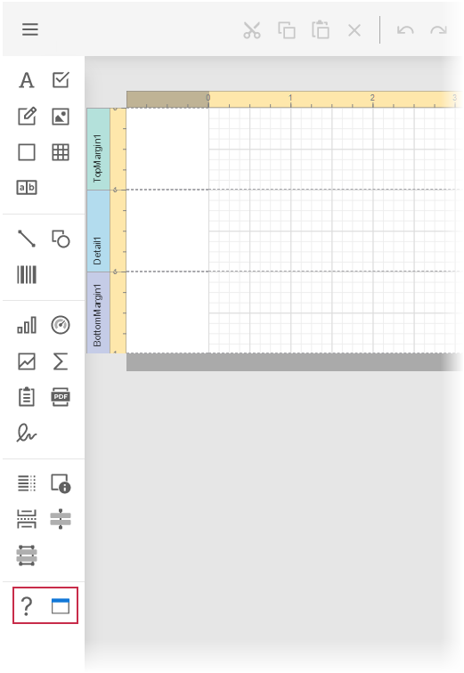

<!-- default badges list -->

<!-- default badges end -->
# Reporting for ASP.NET Web Forms - Create a Custom Report Control

This example demonstrates how to create a custom report control and add it to the End-User Report Designer toolbox.

## Files to Review

- [MyControl.cs](./CS/CustomReportControlSample/CustomControls/MyControl.cs)(VB: [MyControl.vb](./VB/CustomReportControlSample/CustomControls/MyControl.vb))
- [NumericLabel.cs](./CS/CustomReportControlSample/CustomControls/NumericLabel.cs) (VB: [NumericLabel.vb](./VB/CustomReportControlSample/CustomControls/NumericLabel.vb)
- [Designer.aspx.cs](./CS/CustomReportControlSample/Designer.aspx.cs) (VB: [Index.cshtml](./VB/CustomReportControlSample/Designer.aspx.vb))

## Documentation

- [Create and Register a Custom Control in the Report Designer Toolbox (ASP.NET Web Forms)](https://docs.devexpress.com/XtraReports/113773/web-reporting/asp-net-webforms-reporting/end-user-report-designer-in-asp-net-web-forms-reporting/customization/register-a-custom-control-in-the-report-designer-toolbox)

## More Examples

- [How to Create a Custom DevExpress Report Control](https://github.com/DevExpress-Examples/Reporting-Custom-Controls)
- [Reporting for ASP.NET MVC - Create a Custom Report Control](https://github.com/DevExpress-Examples/Reporting-AspNetMvc-Create-Custom-Control)
- [Reporting for ASP.NET Core - Create a Custom Report Control](https://github.com/DevExpress-Examples/Reporting-AspNetCore-Create-Custom-Control)
<!-- feedback -->
## Does this example address your development requirements/objectives?

 

(you will be redirected to DevExpress.com to submit your response)
<!-- feedback end -->
